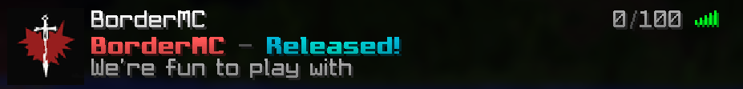

# MOTD

This is a collection of all messages that are displayed in the server list. The built configuration file can be found in [main.conf](main.conf).

## Pull requests

We accept your submissions! You may clone this repository, add a new line in [edit-me.txt](edit-me.txt) and create a pull request in <https://github.com/BorderMC/motd/pulls>.

When the pull request gets approved, Github will update [main.conf](main.conf) to match [edit-me.txt](edit-me.txt).

### Rules

To avoid controversy or inappropriate sentences, the guideline rules below will define what we will **NOT** accept:

- No advertisements
- No slurs
